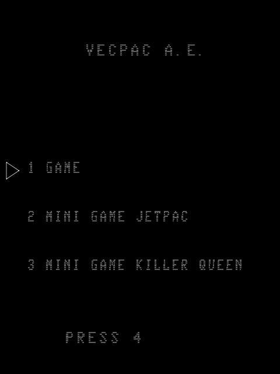
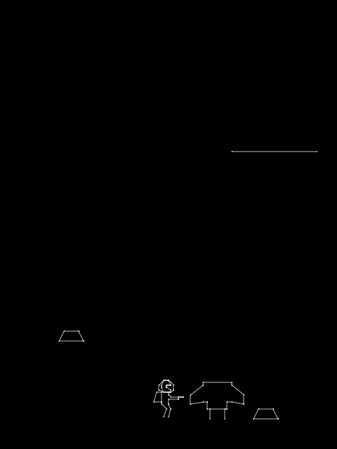
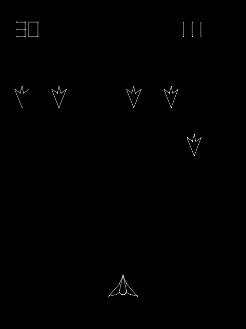
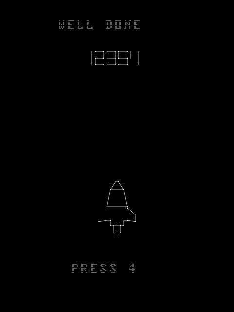

# VECPAC A.E.

**VECPAC A.E.** is a homebrew cartridge for the **GCE/Milton Bradley Vectrex**, written in Motorola 6809 assembly.

It combines three selectable modes in a single 9,255-byte cartridge image:

| Mode | Description |
| --- | --- |
| **1 GAME** | A complete 30-level campaign: three cycles of 8 Jetpac levels followed by 2 Killer Queen levels, with rising difficulty. Score, lives and the high-score table carry across both game types. |
| **2 MINI GAME JETPAC** | Standalone Jetpac mode: 24 levels, four ship designs and a dedicated victory screen. |
| **3 MINI GAME KILLER QUEEN** | Standalone fixed-screen shooter mode with formation dives, the Killer Queen encounter and progressively harder laps. |

Running out of lives returns to the cartridge menu. The persistent high-score table is used by the full 30-level campaign.



## Screenshots

| Jetpac | Killer Queen |
| --- | --- |
|  |  |



## Controls

### Cartridge menu

- **Joystick 1 Up / Down** — select a mode
- **Button 4** — start

### Jetpac

- **Joystick 1 Left / Right** — move
- **Button 1** — thrust
- **Button 4** — fire laser

### Killer Queen

- **Joystick 1 Left / Right** — move
- **Button 4** — fire
- **Button 1** — activate the shield when available

## Download

The ready-to-run cartridge image is in [`release/VecpacAE.vec`](release/VecpacAE.vec).

A small release package with instructions is also available as [`release/VecpacAE_v1.0.zip`](release/VecpacAE_v1.0.zip).

**Cartridge size:** 9,255 bytes — about 28% of a 32K cartridge.

**SHA-256:** `7e84fa5fa3b845c4c59c1ae6215ff1e1fa46bd163223a40ea5dd0d8756ba7cb2`

## Running the game

Use any Vectrex emulator that can load `.vec` cartridge images, or run it on real hardware with a compatible flash/reprogrammable cartridge.

Example with MAME:

```text
mame vectrex -rompath <folder-containing-vectrex.zip> -cart VecpacAE.vec -skip_gameinfo -window
```

The **Vectrex BIOS is not included** in this repository.

## Building from source

The public source is in [`src/`](src/). The combined cartridge is generated from:

- `src/supervisor.asm` — cartridge menu and shared campaign state
- `src/jetpac.asm` — Jetpac mode
- `src/gx.asm` — Killer Queen mode
- `src/vectrex.i` — Vectrex BIOS/RAM symbol definitions

### Requirements

- **asm6809 2.17** or a compatible asm6809 build
- Windows PowerShell for the supplied build script
- MAME and a legally obtained Vectrex BIOS only if you want to use `-Play`

Place the assembler at:

```text
tools/asm6809-2.17-w64/asm6809.exe
```

Then run:

```powershell
.\build.ps1
```

The generated cartridge will be written to:

```text
build/VecpacAE.vec
```

To build and immediately launch it in MAME, also provide MAME and your own BIOS as described in the script, then run:

```powershell
.\build.ps1 -Play
```

## Project structure

```text
src/                 6809 assembly source
tools/               build helper scripts
release/             ready-to-run .vec cartridge and release ZIP
screenshots/         genuine MAME captures
docs/                GitHub Pages website
SPECIFICATION.md     Jetpac behaviour specification used for the port
build.ps1            complete cartridge build script
```

## Technical notes

The full campaign contains **30 levels** arranged as three cycles. Each cycle contains eight Jetpac levels followed by two Killer Queen levels. Campaign score and reserve lives are transferred between the two game engines by the cartridge supervisor.

The Jetpac implementation was developed from a behavioural specification rather than copied Z80 source. See [`SPECIFICATION.md`](SPECIFICATION.md) for the detailed reference notes.

## Credits and notice

Project and Vectrex implementation: **MmmPT**.

The Jetpac mode is an unofficial fan adaptation of the 1983 game *Jetpac*. No affiliation with or endorsement by the original publisher or current rights holders is implied. Original game names and related intellectual property remain the property of their respective owners.

The source code is published for study, preservation and personal use. No Vectrex BIOS, MAME binary, or other third-party ROM is distributed here.
